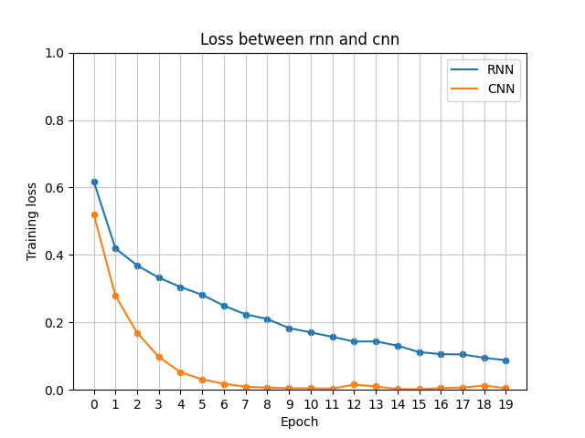
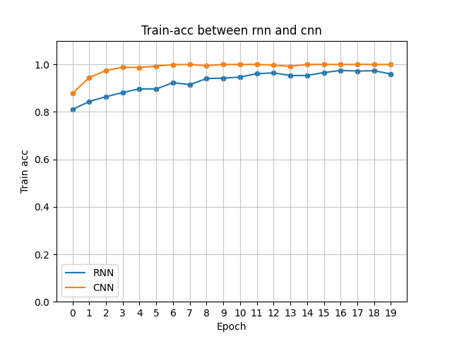
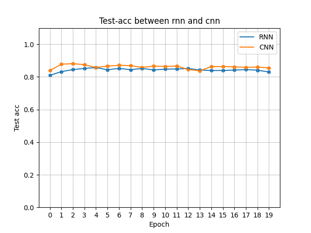
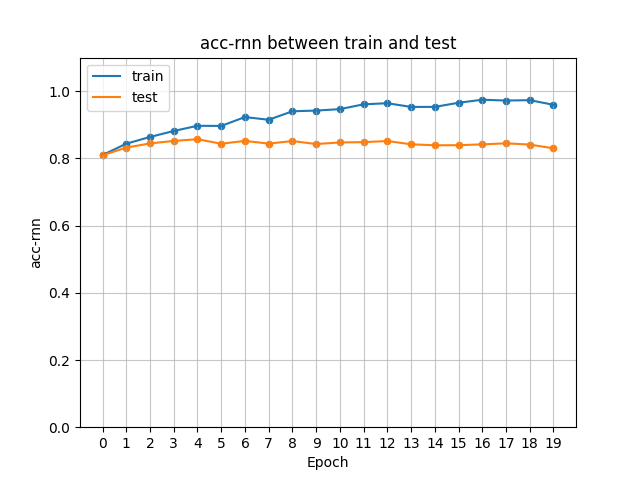
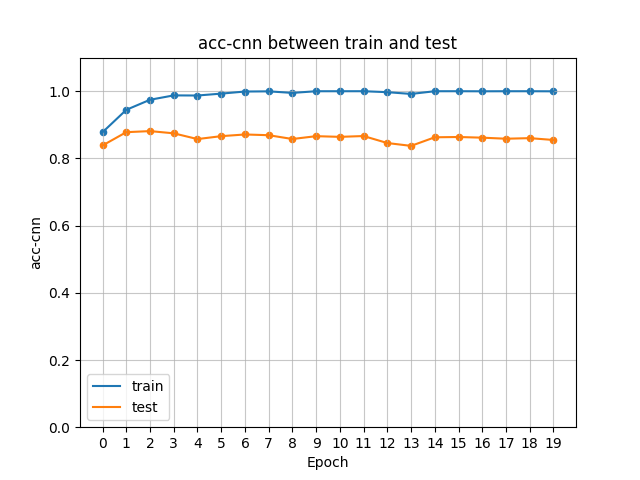

## NLP应用——文本情感分析

### 背景

尝试第一个NLP实践项目，检查自己对NLP处理流程及对应模型训练的熟悉程度，同时希望提高自己的pytorch的coding能力，发现更多关于我训练模型流程中那些可能存在的bug!


### 目录介绍：主要文件介绍

- main.ipynb： rnn实现模型(已完成)
- cnn.ipynb： cnn实现模型(已完成)
- data_preprocess： 自定义数据预处理模块
- net_frame： 常用NLP模型框架及函数集
- embed_layer： embedding层实现
- plots： rnn/cnn实验的loss、train_acc、test_acc结果python列表对象
- compares： 结果图
- plot_compare.py： 绘制实验比较图脚本


### 日志

#### 5.27 2025
- 数据预处理完成

#### 5.28 2025
- 1.采用RNN架构搭建模型，模型训练效果一直很差，debug de到死发现是构造Dataloader时shuffle = False,因为是二分类问题，按顺序每次拟合了前面的类别，这是导致loss跳变的原因.
<br>

- 2.解决训练效果后发现仅拟合了训练集，而测试集acc始终为50%左右，对于二分类问题效果几乎为0,一开始认为是模型原因，后面发现是Vocab的原因，即我的train_vocab与test_vocab不一样，这样导致训练与测试时的token_to_idx不一样，即每个word的编码都不一样，所以效果差.

<br>

- 3.构建vocab可以提高min_freq,以减少embedding层的参数量.

#### 5.29 2025

- 1.模型嵌入层记得冻结，不需要更新
    ```py
    # 加载
    net.embedding.weight.data.copy_(embeds)
    net.embedding.weight.requires_grad = False
    ```

- 2.采用TextCNN架构，由于前期工作较为完善，直接移植模型，相同的预处理，直接跑通.且5次epoch训练集上接近100%

- 3.cnn计算量比rnn大，但是训练速度却比rnn快，因为rnn是**顺序模型**，难以并行计算.

- 4.rnn与cnn训练效果、准确率对比

  (1)LOSS
  

  (2)train_acc
  

  (3)test_acc
  

- 5.rnn与cnn训练过拟合情况对比

  (1)rnn
  

  <br>

  (2)cnn
  

#### 5.31 2025

第一次实现多卡训练的效率高于单卡，因为加大了batch_size，因为是nn.DataParallel()，即数据并行，所以数据量大的时候多卡带来的速度提升才能超过通信带来的额外时间开销.

## 后记

### 一、意外之喜——tqdm的性能分析

- 问题发现
其实这个的性能跟循环次数有关，每次调用loop.set_description的时间几乎都是定的，所以对于循环次数多，循环主体
用时少的，这个就会成为影响性能的罪魁祸首!!!

- 隐藏原因
之前 没发现是因为在VGG中对图像识别处理数据集的时候，有batch_size,导致循环次数少，且循环主体又比较耗时，故几乎
不影响.

性能差的代码
```py
for x in loop:
    body
    loop.set_description(f"read {label}")
```

优化方法1
```py
loop = tqdm(xxxx,desc = f"read {label}") # 在循环前指定
for x in loop:
    body
```

优化方法2
```py
for x in loop:
    body
    loop.set_description(f"read {label}",refresh = False) # 设置仅绘制一次，关闭动态刷新
```

**补充：发现问题的代码在main.ipynb,可以自己尝试去运行**

### 二、torch.nn.Crossentropyloss()的使用采坑点

假设定义loss如下
```py
loss = torch.nn.CrossEntropyLoss(reduction = 'none')
```

loss有如下两种用法——参考官网

```py
# Example of target with class indices
loss = nn.CrossEntropyLoss()
input = torch.randn(3, 5, requires_grad=True)
target = torch.empty(3, dtype=torch.long).random_(5)
output = loss(input, target)
output.backward()

# Example of target with class probabilities
input = torch.randn(3, 5, requires_grad=True)
target = torch.randn(3, 5).softmax(dim=1)
output = loss(input, target)
output.backward()

# 注意上面调用loss()时,argument_1为y_pred，argument_2为target!
```

- 对于y_pred = (N,nums),y_labels = (N)时，此时y_labels代表**类别索引**，要求y_labels的类型为**Long**.
<br>
- 对于y_pred = (N,nums),y_labels = (N,nums)，此时y_labels被解释为概率分布，**所以如果使用one_hot格式的labels,要求dtype = float**，而一般one_hot后的dtype = Long,这一点要注意!!

**补充：问题实验代码在crossentropyloss.ipynb**
